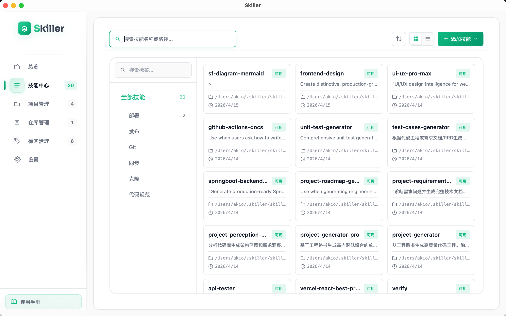
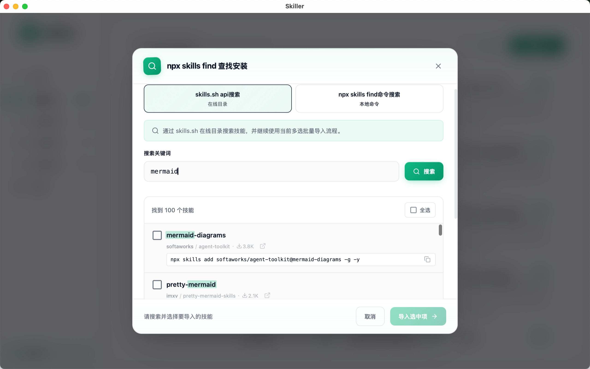
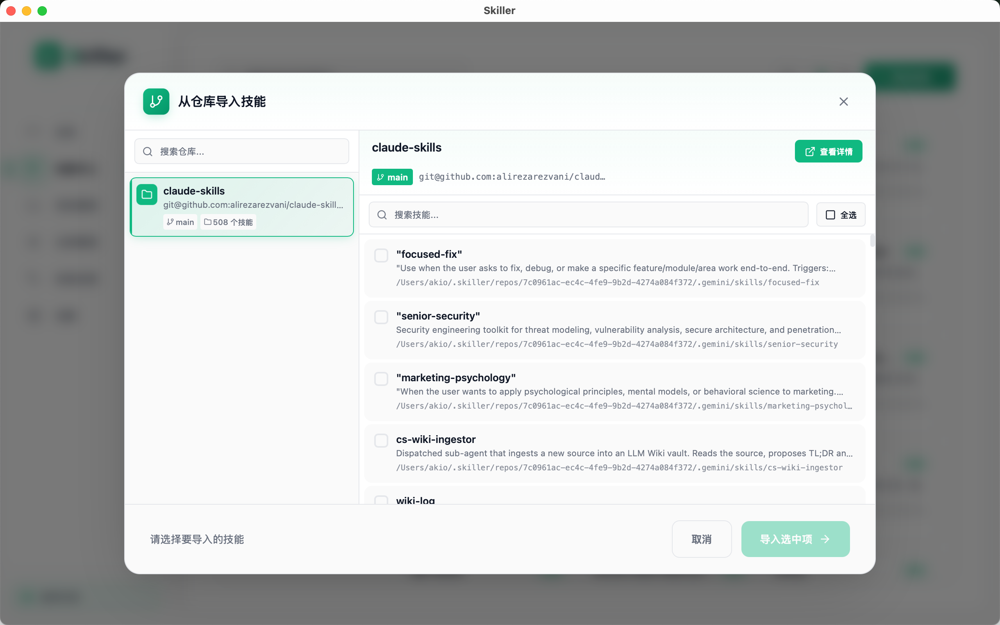
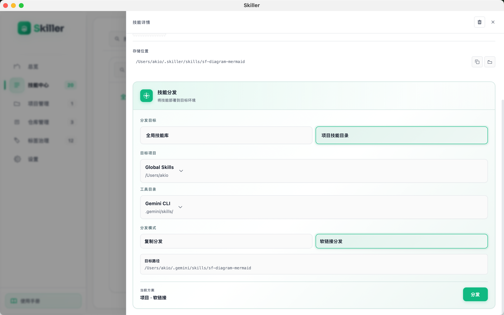
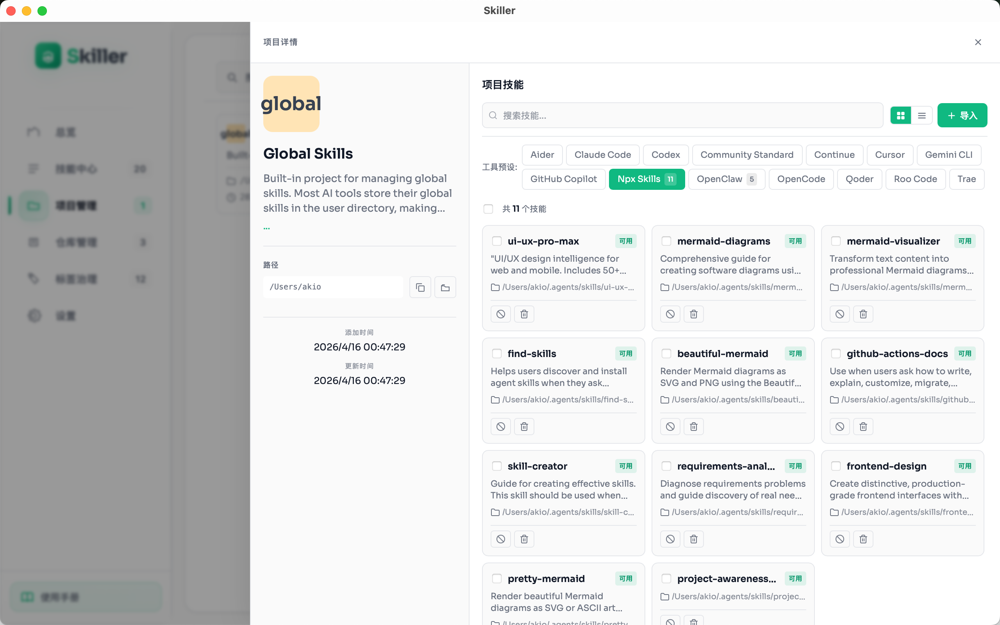
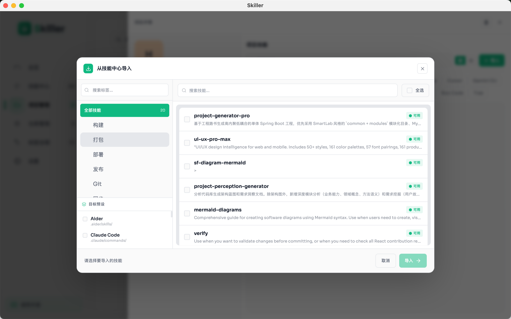
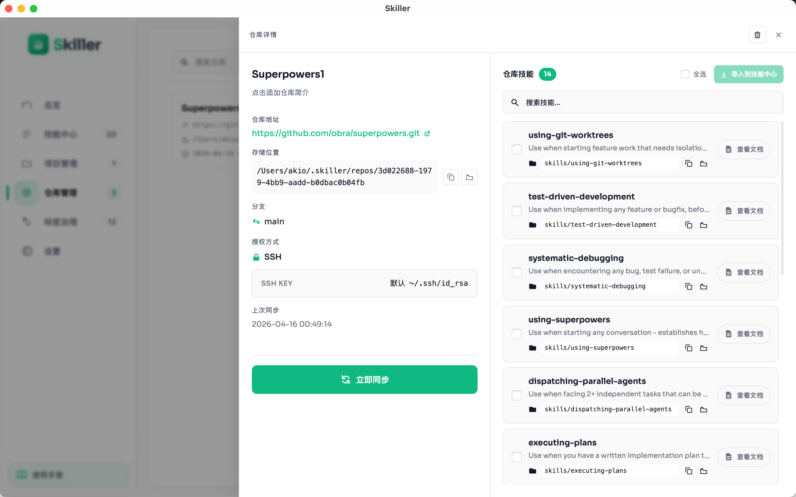
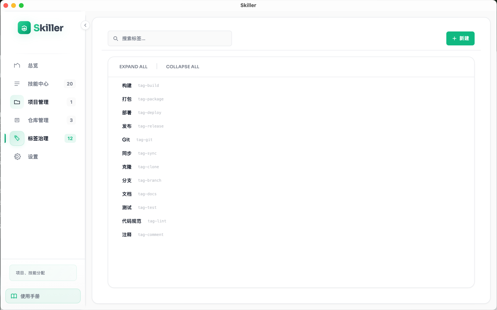
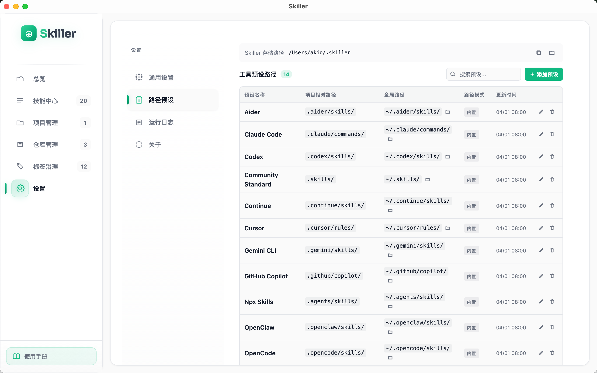

# Skiller - Cross-Platform Skill Management Tool

**Version**: v0.1.5<br/>
**Status**: Production Ready<br/>
**GitHub**: [https://github.com/AFunc-OPC/Skiller](https://github.com/AFunc-OPC/Skiller)<br/>
**Homepage**: [https://afunc-opc.github.io/home/](https://afunc-opc.github.io/home/)<br/>
📄 **中文版**: [README.md](./README.md)<br/>

## Overview

Skiller is a cross-platform desktop application for unified management of AI tool Skills (skills/prompt configurations). It supports multiple AI CLI tools (Claude Code, OpenCode, Cursor, etc.), providing a visual management interface for centralized Skill management, category tagging, project distribution, and more.

## Quick Start

Download the installer for your platform from [GitHub Releases](https://github.com/AFunc-OPC/Skiller/releases):

| Platform   | Installer Format         | Notes                                                                 |
|------------|--------------------------|-----------------------------------------------------------------------|
| **macOS**  | `.dmg`                   | Supports Intel (x64) and Apple Silicon (aarch64), universal recommended<br />Mac users need to remove quarantine attribute<br/>`xattr -cr /Applications/Skiller.app` |
| **Windows**| `.msi` / `.exe`          | MSI installer or NSIS installer, supports x64                        |
| **Linux**  | `.deb` / `.rpm`          | DEB for Debian/Ubuntu as common format                               |

Simply install and use after downloading.

## Screenshots




















## Tech Stack

| Layer        | Technology      | Version | Notes                        |
|--------------|-----------------|---------|------------------------------|
| Backend      | Tauri           | 2.x     | Cross-platform desktop framework |
| Runtime      | Rust            | 1.75+   | High-performance backend     |
| Frontend     | React           | 18.x    | Modern UI                    |
| Build Tool   | Vite            | 5.x     | Fast HMR                     |
| UI Framework | Tailwind CSS    | 3.x     | Atomic CSS                   |
| State Mgmt   | Zustand         | 4.x     | Lightweight state management |
| Database     | SQLite          | 3.x     | WAL mode, local storage      |
| Icons        | Lucide React    | 0.3.x   | Rich icon library            |

## Features

### V0.1.5 Core Features

- ✅ **Skill Center Management** - Create, edit, delete, search Skills
- ✅ **Tag Category Management** - Tag grouping, many-to-many association, sidebar filtering
- ✅ **Project Management** - Project list, custom Skill directories, preset tool selection
- ✅ **Repository Management** - Online repository integration, pull updates
- ✅ **Skill Distribution** - Copy/soft link distribution to projects
- ✅ **Multi-environment Configuration** - Development, testing, production environment support
- ✅ **Internationalization** - Chinese/English bilingual support
- ✅ **Light/Dark Theme** - Theme switching

## Project Structure

```
skiller-final/
├── src-tauri/                    # Tauri backend (Rust)
│   ├── src/
│   │   ├── main.rs              # Application entry
│   │   ├── lib.rs               # Library entry
│   │   ├── commands/            # Tauri command layer
│   │   ├── services/            # Business service layer
│   │   ├── db/                  # Database layer
│   │   ├── models/              # Data models
│   │   └── utils/               # Utility functions
│   ├── Cargo.toml               # Rust dependencies
│   └── tauri.conf.json          # Tauri configuration
│
├── src/                          # Frontend source (React + TypeScript)
│   ├── main.tsx                 # Application entry
│   ├── App.tsx                  # Root component
│   ├── index.css                # Global styles
│   ├── api/                     # API wrappers
│   ├── stores/                  # State management
│   ├── types/                   # Type definitions
│   └── i18n/                    # Internationalization
│
├── public/                       # Static assets
├── package.json                  # Frontend dependencies
├── tsconfig.json                 # TypeScript configuration
├── vite.config.ts                # Vite configuration
└── tailwind.config.js            # Tailwind configuration
```

## Getting Started

### Environment Requirements

#### All Platforms

- **Node.js**: 18.x or higher
- **npm**: 9.x or higher
- **Rust**: 1.75 or higher, recommended to install via `rustup`
- **Git**: For pulling repositories and some dependency scenarios

Verify your versions first:

```bash
node -v
npm -v
rustc -V
cargo -V
```

### Platform Dependency Installation

#### macOS

1. Install Xcode Command Line Tools:

```bash
xcode-select --install
```

2. Install Node.js (if not installed, use Homebrew):

```bash
brew install node
```

3. Install Rust:

```bash
curl --proto '=https' --tlsv1.2 -sSf https://sh.rustup.rs | sh
```

Note: macOS does not require additional WebKit/GTK runtime libraries; the system includes WebView.

#### Windows

1. Install Node.js LTS.
2. Install Rust: Visit `https://rustup.rs/` or use `winget install Rustlang.Rustup`.
3. Install Microsoft Visual Studio C++ Build Tools, at least include:

- Desktop development with C++
- MSVC v143 Build Tools
- Windows 10/11 SDK

4. Ensure WebView2 Runtime is installed.

Optional `winget` examples:

```powershell
winget install OpenJS.NodeJS.LTS
winget install Rustlang.Rustup
winget install Microsoft.VisualStudio.2022.BuildTools
winget install Microsoft.EdgeWebView2Runtime
```

#### Linux

The following commands apply to Ubuntu/Debian-based systems:

```bash
sudo apt update
sudo apt install -y \
  build-essential \
  pkg-config \
  curl \
  wget \
  libssl-dev \
  libgtk-3-dev \
  libglib2.0-dev \
  libwebkit2gtk-4.1-dev \
  libjavascriptcoregtk-4.1-dev \
  libsoup-3.0-dev \
  libayatana-appindicator3-dev \
  librsvg2-dev \
  libxdo-dev \
  patchelf
```

Note: If you encounter errors about missing `glib-2.0`, `gdk-3.0`, `webkit2gtk`, etc., it's usually because the above development packages are not fully installed.

### Install Project Dependencies

Run in the project root directory:

```bash
npm install
```

Rust dependencies will be automatically downloaded and compiled on first `cargo build` or `npm run tauri:dev`.

### Development and Running

#### Option A: Step-by-step Debugging (Recommended)

Suitable for first startup, troubleshooting environment issues, distinguishing frontend and Tauri native issues.

1. Start frontend only:

```bash
npm run dev
```

Visit `http://localhost:5173` to confirm the page loads. Note this is only frontend debugging, Tauri API cannot be called.

2. Build Rust backend separately:

```bash
cd src-tauri
cargo build
cd ..
```

3. Start the full desktop application:

```bash
npm run tauri:dev
```

#### Option B: Start Full Application Directly

```bash
npm run tauri:dev
```

This command will first start Vite, then launch the Tauri development window. First-time compilation of Rust dependencies typically takes 5-15 minutes.

#### Platform Debug Commands

macOS / Linux:

```bash
RUST_BACKTRACE=1 RUST_LOG=info npm run tauri:dev
```

Windows PowerShell:

```powershell
$env:RUST_BACKTRACE="1"
$env:RUST_LOG="info"
npm run tauri:dev
```

#### Common Debugging Scenarios

- **Frontend UI only**: `npm run dev`
- **Verify Rust compiles independently**: `cd src-tauri && cargo build`
- **Check build pipeline**: `npm run tauri:build`
- **View detailed Rust error stack**: Set `RUST_BACKTRACE=1`

#### Database Default Paths by Platform

- **macOS**: `~/Library/Application Support/com.skiller.desktop/skiller.db`
- **Windows**: `%APPDATA%\com.skiller.desktop\skiller.db`
- **Linux**: `~/.config/com.skiller.desktop/skiller.db`

#### Startup Script Notes

- `./start-app.sh` for macOS / Linux Bash environment
- Windows please use `npm run tauri:dev` or manually execute the step-by-step debugging commands above

#### Common Startup Failure Troubleshooting Order

1. `npm install`
2. `npm run dev`, confirm frontend is available
3. `cd src-tauri && cargo build`, confirm native dependencies are complete
4. `npm run tauri:dev`

If step 3 fails, prioritize checking if platform dependencies are fully installed rather than just waiting for recompilation.

## Build and Release

### Quick Build Commands

```bash
# Build for current platform (auto-detect)
npm run tauri:build

# macOS universal binary (Intel + Apple Silicon, macOS only)
npm run tauri:build:mac

# macOS single architecture (macOS only)
npm run tauri:build:mac-arm    # Apple Silicon (M1/M2/M3)
npm run tauri:build:mac-x64    # Intel
```

> **Important**: Tauri does not support cross-compilation. Windows and Linux versions must be built natively on the respective platform or use GitHub Actions for automated builds.

### One-Click Cross-Platform Build (Recommended)

Use GitHub Actions to automatically build installers for all platforms:

1. Create and push a Git tag:

   ```bash
   git tag v0.1.1
   git push origin v0.1.1
   ```
2. GitHub Actions automatically builds:

   - **macOS**: `.dmg` (aarch64 + x64 + universal)
   - **Windows**: `.msi` + `.exe` (NSIS)
   - **Linux**: `.deb` + `.AppImage`
3. Download installers from GitHub Releases page

See [`.github/workflows/release.yml`](./.github/workflows/release.yml) for detailed configuration.

### Build Methods by Platform

#### macOS

**Development build**:

```bash
npm run tauri:build
```

**Output location**:

- `src-tauri/target/release/bundle/dmg/` - DMG installer
- `src-tauri/target/release/bundle/macos/` - .app application bundle

**Supported architectures**:

- Intel (x86_64)
- Apple Silicon (aarch64)

**Notes**:

1. For signing and notarization, configure certificates in `tauri.conf.json`
2. Universal Binary requires compiling both architectures separately then merging

**Signing commands example**:

```bash
# Sign
codesign --deep --force --verify --verbose --sign "Developer ID Application: Your Name" src-tauri/target/release/bundle/macos/Skiller.app

# Notarize
xcrun notarytool submit src-tauri/target/release/bundle/dmg/Skiller_1.1.0_x64.dmg --apple-id "your@email.com" --team-id "TEAMID" --password "app-specific-password"
```

**"App is damaged" issue after installation**:

Since the app is not signed, macOS Gatekeeper will prevent running. Solution:

```bash
# Remove quarantine attribute
xattr -cr /Applications/Skiller.app
```

Or in System Settings: System Settings → Privacy & Security → Still Open

#### Windows

**Development build**:

```bash
npm run tauri:build
```

**Output location**:

- `src-tauri/target/release/bundle/msi/` - MSI installer
- `src-tauri/target/release/bundle/nsis/` - NSIS installer

**Supported architectures**:

- x64 (64-bit)
- x86 (32-bit)

**Notes**:

1. WebView2 Runtime needs to be installed (pre-installed on Windows 10/11)
2. For signing, purchase a code signing certificate and configure

**Signing command example**:

```powershell
# Sign using signtool
signtool sign /f "path\to\certificate.pfx" /p password /t http://timestamp.digicert.com src-tauri\target\release\bundle\msi\Skiller_1.1.0_x64.msi
```

#### Linux

**Development build**:

```bash
npm run tauri:build
```

**Output location**:

- `src-tauri/target/release/bundle/deb/` - DEB package (Debian/Ubuntu)
- `src-tauri/target/release/bundle/appimage/` - AppImage (universal format)
- `src-tauri/target/release/bundle/rpm/` - RPM package (Fedora/RHEL)

**Supported architectures**:

- x64 (amd64)
- aarch64 (ARM64)

**Notes**:

1. AppImage is the most universal format, can run without installation
2. DEB/RPM need to be packaged for different distributions

**Installation command examples**:

```bash
# DEB package installation
sudo dpkg -i skiller_1.1.0_amd64.deb

# AppImage execution
chmod +x Skiller_1.1.0_amd64.AppImage
./Skiller_1.1.0_amd64.AppImage

# RPM package installation
sudo rpm -i skiller-1.1.0-1.x86_64.rpm
```

### Cross-Platform Compilation

> **Warning**: Tauri does not support true cross-compilation. The following solutions are for reference only and not guaranteed to work.

**Recommended solution**: Use GitHub Actions to build natively on each platform (see above).

**Alternative solutions**:

1. **VM/Cloud Server**: Install development environment on the target platform then build
2. **Docker + cross**: Linux cross-compilation (complex configuration, not recommended)
   ```bash
   cargo install cross
   cross build --release --target x86_64-unknown-linux-gnu
   ```

### Why Cross-Compilation Is Not Supported?

Tauri depends on platform native libraries:

- **Windows**: WebView2, MSVC Runtime, Windows SDK
- **macOS**: WebKit, Metal, Cocoa
- **Linux**: WebKitGTK, GTK, glib

These libraries cannot be fully supported through cross-compilation toolchains.

## GitHub Actions Automated Build

The project is configured with automated build workflow that builds cross-platform installers when tags are pushed.

### Trigger Method

```bash
# Create and push tag
git tag v0.1.1
git push origin v0.1.1
```

### Build Artifacts

| Platform  | Artifact Formats       | Architectures                 |
|-----------|------------------------|-------------------------------|
| macOS     | `.dmg`, `.app`         | aarch64, x64, universal      |
| Windows   | `.msi`, `.exe`         | x64                           |
| Linux     | `.deb`, `.AppImage`    | amd64                         |

### Workflow Configuration

See [`.github/workflows/release.yml`](./.github/workflows/release.yml) for full configuration.

**Key features**:

- Automatic Rust dependency caching, faster builds
- Supports macOS Universal Binary
- Automatic GitHub Release creation
- Supports draft release mode

## Development Guide

### Coding Standards

- **Rust**: Follow Rust official coding standards
- **TypeScript**: Use ESLint + Prettier
- **Component naming**: PascalCase
- **File naming**: kebab-case

### Commit Standards

```
feat: New feature
fix: Bug fix
docs: Documentation update
style: Code formatting
refactor: Refactoring
test: Testing related
chore: Build tools, dependency updates
```

### Branch Management

- `main`: Main branch, stable releases
- `develop`: Development branch
- `feature/*`: Feature branches
- `hotfix/*`: Emergency fix branches

## Database Schema

The application uses SQLite for storage, supporting the following tables:

- `skills` - Skill storage
- `tags` - Tag storage
- `tag_groups` - Tag grouping
- `skill_tags` - Skill-Tag association (many-to-many)
- `projects` - Project storage
- `project_skills` - Project-Skill association
- `repos` - Repository storage
- `config` - Configuration storage
- `tool_presets` - Tool presets

Database file location:

| Platform  | Path                                                             |
|-----------|------------------------------------------------------------------|
| macOS     | `~/Library/Application Support/com.skiller.desktop/skiller.db` |
| Windows   | `%APPDATA%\com.skiller.desktop\skiller.db`                     |
| Linux     | `~/.config/com.skiller.desktop/skiller.db`                      |

**Notes**:

- The application automatically creates the database and required directories on first run
- The database includes preset `tag_groups` (Build & Distribution, Sync & Repository, Docs & Quality) and `tool_presets` (Cursor, Claude Code, OpenCode)
- All data is stored locally, no cloud synchronization

**Viewing the database**:

```bash
# macOS
ls -la ~/Library/Application\ Support/com.skiller.desktop/

# View database schema
sqlite3 ~/Library/Application\ Support/com.skiller.desktop/skiller.db ".schema"

# View all tables
sqlite3 ~/Library/Application\ Support/com.skiller.desktop/skiller.db ".tables"

# View preset data
sqlite3 ~/Library/Application\ Support/com.skiller.desktop/skiller.db "SELECT * FROM tag_groups;"
sqlite3 ~/Library/Application\ Support/com.skiller.desktop/skiller.db "SELECT * FROM tool_presets;"
```

**Changing storage location**:

To change the database storage location, edit `src-tauri/tauri.conf.json`:

```json
{
  "identifier": "com.skiller.desktop"  // Changing this value changes the storage directory
}
```

Or modify the path logic in `src-tauri/src/main.rs`.

## Security Notes

- ✅ Only accesses user-specified directories
- ✅ Sensitive configuration injected via environment variables
- ✅ Does not log Skill content
- ✅ Local storage only, no cloud synchronization

## License

MIT License

## Contact

- GitHub: [https://github.com/AFunc-OPC/Skiller](https://github.com/AFunc-OPC/Skiller)
- Homepage: [https://afunc-opc.github.io/home/](https://afunc-opc.github.io/home/)
- Issues: [https://github.com/AFunc-OPC/Skiller/issues](https://github.com/AFunc-OPC/Skiller/issues)