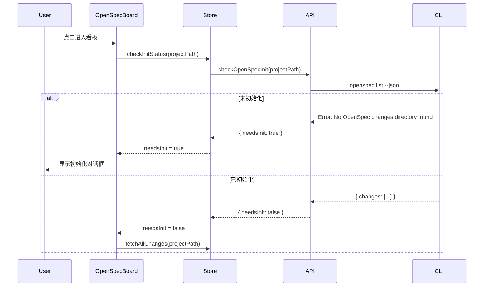
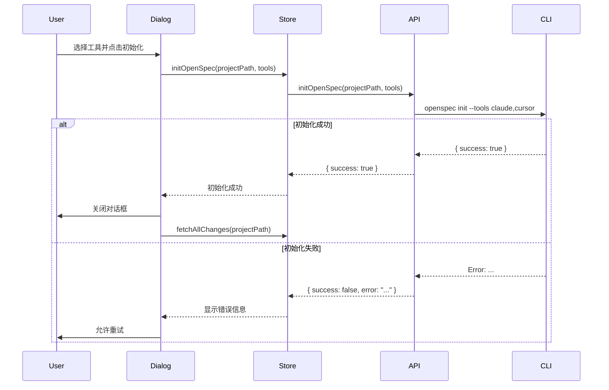

# OpenSpec 初始化检测与引导设计

**日期：** 2026-05-04  
**状态：** 待实现  
**优先级：** 高

## 概述

在项目管理中，当用户打开 OpenSpec 看板时，自动检测当前项目是否已初始化 OpenSpec 环境。如果未初始化，显示引导对话框帮助用户完成初始化配置。

## 背景

目前，OpenSpec 看板只能显示已初始化项目的变更信息。用户如果未初始化项目，会看到空白或错误页面，体验不佳。需要提供友好的引导流程，帮助用户快速初始化 OpenSpec 环境。

## 目标

1. 自动检测项目是否已初始化 OpenSpec 环境
2. 为未初始化项目提供清晰的引导流程
3. 支持用户选择要配置的 AI 工具
4. 提供简单易用的初始化界面

## 架构设计

### 新增组件

**OpenSpecInitDialog.tsx**
- 独立的初始化对话框组件
- 显示 OpenSpec 支持的工具列表
- 支持多选工具进行初始化

**constants/openspec.ts**
- 定义 OpenSpec 支持的工具列表常量
- 包含所有官方支持的 AI 工具 ID

### 修改文件

**前端：**
- `OpenSpecBoard.tsx` - 添加初始化检测逻辑
- `openspecStore.ts` - 添加初始化状态管理
- `api/openspec.ts` - 添加初始化相关 API
- `i18n/zh.ts` 和 `i18n/en.ts` - 添加国际化文本

**后端：**
- `commands/openspec.rs` - 添加初始化命令处理和检测逻辑

## 数据流设计

### 初始化检测流程



### 初始化执行流程



### 状态管理

在 `openspecStore` 中新增以下状态：

```typescript
interface OpenSpecState {
  // ... 现有状态
  
  // 新增状态
  needsInit: boolean           // 是否需要初始化
  initLoading: boolean         // 初始化进行中
  initError: string | null     // 初始化错误信息
  
  // 新增方法
  checkInitStatus: (projectPath: string) => Promise<void>
  initOpenSpec: (projectPath: string, tools: string[]) => Promise<void>
}
```

## UI 设计

### OpenSpecInitDialog 组件

**布局结构：**

```
┌─────────────────────────────────────────┐
│  初始化 OpenSpec 环境                    │
├─────────────────────────────────────────┤
│                                         │
│  当前项目尚未初始化 OpenSpec 环境。      │
│  请选择要配置的工具：                    │
│                                         │
│  ┌─────────────────────────────────┐    │
│  │ ☑ Claude                        │    │
│  │ ☑ Cursor                        │    │
│  │ ☐ Cline                         │    │
│  │ ☐ Continue                      │    │
│  │ ☐ Codex                         │    │
│  │ ☐ Windsurf                      │    │
│  │ ... (其他工具，支持滚动)         │    │
│  └─────────────────────────────────┘    │
│                                         │
│  [全选] [取消全选]                       │
│                                         │
│  [取消]              [初始化]            │
└─────────────────────────────────────────┘
```

**交互行为：**

1. **对话框显示条件：**
   - `needsInit === true` 时显示对话框
   - 对话框为模态，阻止用户操作看板其他部分

2. **工具选择：**
   - 所有工具默认未选中
   - 用户通过多选框选择工具
   - 至少选择一个工具后，"初始化"按钮才可用

3. **全选/取消全选：**
   - "全选"：选中所有工具
   - "取消全选"：取消所有选中

4. **初始化过程：**
   - 点击"初始化"按钮后，按钮显示 loading 状态
   - 初始化过程中禁用所有操作
   - 成功后自动关闭对话框并刷新看板
   - 失败后显示错误信息，允许重试

5. **取消操作：**
   - 点击"取消"按钮关闭对话框
   - 用户可以看到空白的看板界面

### 样式规范

- 对话框宽度：480px
- 工具列表高度：300px（超出滚动）
- 按钮样式：与现有对话框保持一致
- 错误提示：红色文本，显示在对话框底部

## 支持的工具列表

OpenSpec 支持以下 AI 工具（按字母排序）：

```typescript
export const OPENSPEC_SUPPORTED_TOOLS = [
  'amazon-q',
  'antigravity',
  'auggie',
  'bob',
  'claude',
  'cline',
  'codex',
  'forgecode',
  'codebuddy',
  'continue',
  'costrict',
  'crush',
  'cursor',
  'factory',
  'gemini',
  'github-copilot',
  'iflow',
  'junie',
  'kilocode',
  'kimi',
  'kiro',
  'opencode',
  'pi',
  'qoder',
  'lingma',
  'qwen',
  'roocode',
  'trae',
  'windsurf',
] as const
```

## API 设计

### 前端 API

**api/openspec.ts 新增方法：**

```typescript
export const openspecApi = {
  // ... 现有方法
  
  // 检查是否需要初始化
  checkOpenSpecInit: async (projectPath: string): Promise<{
    needsInit: boolean
    error?: string
  }> => {
    return await invoke('check_openspec_init', { projectPath })
  },
  
  // 执行初始化
  initOpenSpec: async (projectPath: string, tools: string[]): Promise<{
    success: boolean
    message?: string
    error?: string
  }> => {
    return await invoke('init_openspec', { projectPath, tools })
  },
}
```

### 后端 API

**commands/openspec.rs 新增命令：**

```rust
#[tauri::command]
pub fn check_openspec_init(project_path: String) -> Result<CheckInitResult, String> {
    // 执行 openspec list --json
    // 如果返回错误包含 "No OpenSpec changes directory found"
    // 则 needsInit = true
}

#[tauri::command]
pub fn init_openspec(project_path: String, tools: Vec<String>) -> Result<InitResult, String> {
    // 执行 openspec init --tools tool1,tool2,...
    // 返回执行结果
}
```

## 国际化

### 中文

```typescript
{
  openspecInitTitle: '初始化 OpenSpec 环境',
  openspecInitDescription: '当前项目尚未初始化 OpenSpec 环境。请选择要配置的工具：',
  openspecSelectTools: '选择工具',
  openspecSelectAll: '全选',
  openspecDeselectAll: '取消全选',
  openspecInitButton: '初始化',
  openspecInitCancel: '取消',
  openspecInitSuccess: '初始化成功',
  openspecInitFailed: '初始化失败',
  openspecInitRequired: '此项目需要初始化 OpenSpec 环境',
  openspecAtLeastOneTool: '请至少选择一个工具',
}
```

### 英文

```typescript
{
  openspecInitTitle: 'Initialize OpenSpec Environment',
  openspecInitDescription: 'This project has not been initialized with OpenSpec. Please select the tools to configure:',
  openspecSelectTools: 'Select Tools',
  openspecSelectAll: 'Select All',
  openspecDeselectAll: 'Deselect All',
  openspecInitButton: 'Initialize',
  openspecInitCancel: 'Cancel',
  openspecInitSuccess: 'Initialization Successful',
  openspecInitFailed: 'Initialization Failed',
  openspecInitRequired: 'This project requires OpenSpec initialization',
  openspecAtLeastOneTool: 'Please select at least one tool',
}
```

## 错误处理

### 错误场景

1. **CLI 未安装**
   - 不显示初始化对话框
   - 显示现有的 `CliInstallPrompt` 组件

2. **初始化失败**
   - 在对话框中显示错误信息
   - 允许用户修改选择并重试
   - 提供错误详情（如权限问题、网络问题等）

3. **网络错误**
   - 显示友好的错误提示
   - 提供"重试"按钮

4. **权限错误**
   - 提示用户检查项目目录权限
   - 建议使用管理员权限运行

### 错误恢复策略

- 所有错误都在对话框内显示，不关闭对话框
- 提供明确的错误信息和解决建议
- 支持重试操作

## 测试策略

### 单元测试

**openspecStore.test.ts 新增测试：**

- 测试 `checkInitStatus` 状态更新
- 测试 `initOpenSpec` 成功和失败场景
- 测试状态重置逻辑

### 集成测试

**api/openspec.test.ts 新增测试：**

- 测试 `checkOpenSpecInit` API 调用
- 测试 `initOpenSpec` API 调用
- 测试错误处理

### 组件测试

**OpenSpecInitDialog.test.tsx：**

- 测试对话框显示/隐藏
- 测试工具选择交互
- 测试全选/取消全选功能
- 测试初始化按钮禁用状态
- 测试初始化成功/失败流程
- 测试错误信息显示

### E2E 测试

- 测试完整的初始化流程（从打开看板到初始化完成）
- 测试已初始化项目的正常显示
- 测试 CLI 未安装场景

## 实现优先级

### Phase 1: 核心功能（必须）

1. 添加工具列表常量
2. 实现初始化检测 API
3. 实现初始化执行 API
4. 创建 `OpenSpecInitDialog` 组件
5. 更新 `OpenSpecBoard` 集成检测逻辑
6. 添加国际化文本

### Phase 2: 增强功能（推荐）

1. 添加单元测试和组件测试
2. 优化错误提示信息
3. 添加初始化进度提示

### Phase 3: 优化（可选）

1. 添加工具搜索功能
2. 记住用户常用工具选择
3. 添加工具说明文档链接

## 技术债务

- 无

## 开放问题

- 无

## 相关文档

- OpenSpec CLI 文档：https://openspec.radebit.com/#cli-setup
- 现有 OpenSpec 看板实现：`src/components/OpenSpec/OpenSpecBoard.tsx`

## 变更历史

- 2026-05-04: 初版设计文档
